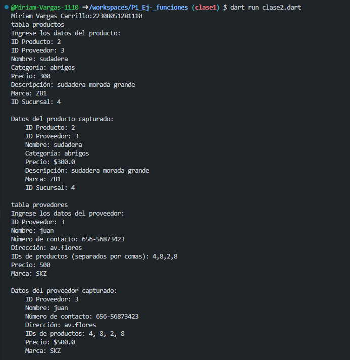
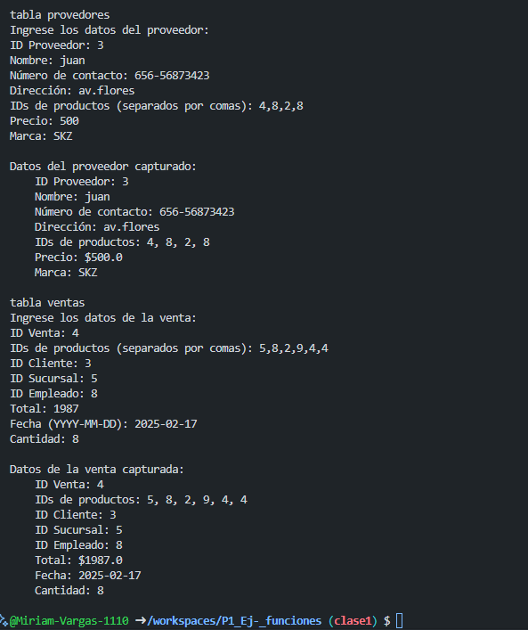

salida de ejemplo clase 2

crear una clase producto con atributos (id-producto, id-proveedor, nombre, categoría, precio, descripción, marca, id-sucursal), una función captura() desde la interfaz y otra mostrar datos(),crear la instancia y utilizar los atributos y llamadas a funciones en lenguaje Dart

crear una clase provedores con atributos (id-provedor, nombre, numero, direccion, id-productos, precio, marca), una función captura() desde la interfaz y otra mostrar datos(),crear la instancia y utilizar los atributos y llamadas a funciones en lenguaje Dart

crear una clase ventas con atributos (id-ventas, id-productos, id-cliente, id-sucursal, id-empleado, total , fecha , cantidad), una función captura() desde la interfaz y otra mostrar datos(),crear la instancia y utilizar los atributos y llamadas a funciones en lenguaje Dart

