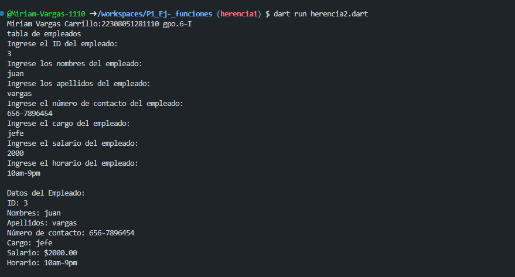
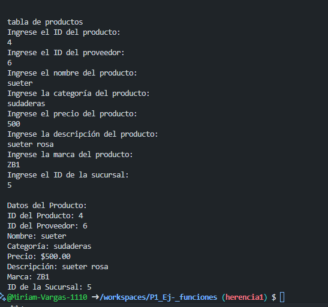

crear la clase Empleados  con los atributos (id-empleados, nombres, apellidos, numero, cargo, salario, horario) con una función capturadatos(), con interacción de interfaz  de usuario. crear la clase DatosEmpleado con herencia Empleados y una funcion mostrarDatos(). lenguaje dart

crear la clase Producto con los atributos (id-producto, id-provedor, nombre, categoria, precio, descripcion, marca, id-sucursal) con una función capturadatos(), con interacción de interfaz  de usuario. crear la clase DatosProducto con herencia Producto y una funcion mostrarDatos(). lenguaje dart

SALIDA DE DATOS

