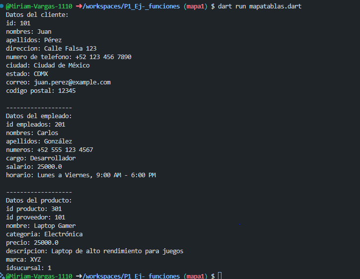

crear map <string, dinamic> productos con los siguientes key, id producto, id provedor, nombre,categoria,precio,descripcion,marca,idsucursal,. y mostrar los datos con un for each. lenguaje dart

crear map <string, dinamic> clientes con los siguientes key, id clientes,nombres,apellidos,direccion,numero de telefono,ciudad, estado, correo,codigo postal. y mostrar los datos con un for each. lenguaje dart

crear map <string, dinamic> empleados con los siguientes key, id empleados, nombres,apellidos,numeros, cargo, salario,horario. y mostrar los datos con un for each. lenguaje dart

